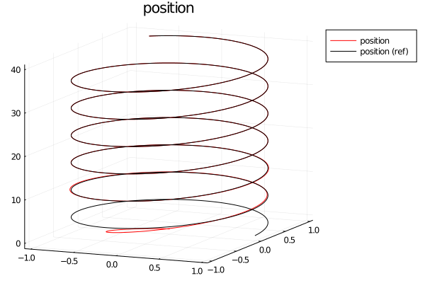

# FaultTolerantControl
[FaultTolerantControl.jl](https://github.com/JinraeKim/FaultTolerantControl.jl) is a package for fault tolerant control (FTC).
## Notes
- This package is based on [FlightSims.jl](https://github.com/JinraeKim/FlightSims.jl),
a general-purpose dynamical system simulator supporting nested environment design.

## Examples
### Nonlinear control
Note that this example is **not an FTC**; an illustration of how to use this package.
- For an example of **backstepping position tracking controller for quadcopters**,
see `main/backstepping_tracking.jl`:
```julia
using FaultTolerantControl
using FlightSims
const FS = FlightSims
using UnPack, ComponentArrays
using Transducers
using Plots


function make_env()
    multicopter = IslamQuadcopterEnv()
    @unpack m, g, B = multicopter
    allocator = PseudoInverseControlAllocator(B)
    x0_multicopter = State(multicopter)()
    pos0 = copy(x0_multicopter.p)
    vel0 = copy(x0_multicopter.v)
    helixCG = FS.HelixCommandGenerator(pos0)
    cg = Command(helixCG)
    controller = BacksteppingPositionControllerEnv(m; pos_cmd_func=cg)
    x0_controller = State(controller)(pos0, m, g)
    x0 = ComponentArray(multicopter=x0_multicopter, controller=x0_controller)
    multicopter, controller, allocator, x0, cg
end

function main()
    multicopter, controller, allocator, x0, cg = make_env()
    prob, sol = sim(x0, Dynamics!(multicopter, controller, allocator); tf=40.0)
    t0, tf = prob.tspan
    Δt = 0.01  # data sampling period; not simulation time step
    ts = t0:Δt:tf
    poss = ts |> Map(t -> sol(t).multicopter.p) |> collect
    poss_ref = ts |> Map(t -> cg(t)) |> collect
    ## plot
    # 3d traj
    p_traj = plot3d(; title="position", legend=:outertopright)
    plot!(p_traj, hcat(poss...)'[:, 1], hcat(poss...)'[:, 2], hcat(poss...)'[:, 3]; label="position", color="red")
    plot!(p_traj, hcat(poss_ref...)'[:, 1], hcat(poss_ref...)'[:, 2], hcat(poss_ref...)'[:, 3]; label="position (ref)", color="black")
    # save
    dir_log = "figures"
    mkpath(dir_log)
    savefig(p_traj, joinpath(dir_log, "traj_multicopter_backstepping.png"))
end
```


### Fault tolerant control (To-do)
