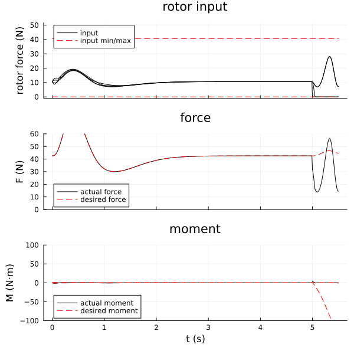

# FaultTolerantControl
[FaultTolerantControl.jl](https://github.com/JinraeKim/FaultTolerantControl.jl) is a package for fault tolerant control (FTC).

## Notes
- This package is based on [FlightSims.jl](https://github.com/JinraeKim/FlightSims.jl).

## Changes in FaultTolerantControl@0.3.0
It is rewritten to be compatible with FlightSims.jl@1.0.0, Julia@1.7.0.

## FTC using various CA (control allocation) methods
See `./test/CA_backstepping.jl`.
Run this at `./`.

Parallel trajectory generation; benchmarks with
i) M1 Macbook Air: 7 threads, about 4s / 7 trajectories
ii) Ryzen 5900X: 24 threads, about 5s / 24 trajectories

- [ ] Make a trajectory generator; to save trajectory command
via JLD2 safely (without reconstruction).

### Notes
Previously written examples are deprecated; see previous versions, e.g., FaultTolerantControl@0.2.0.
